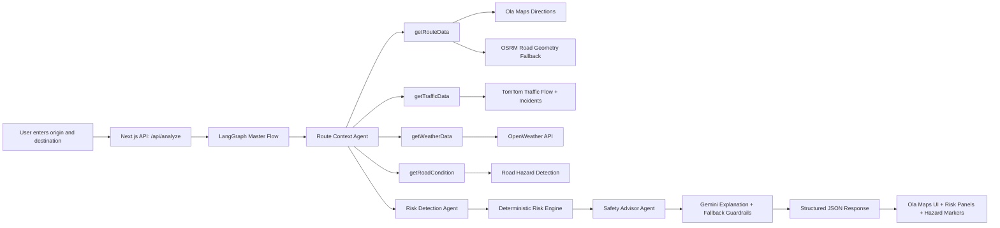
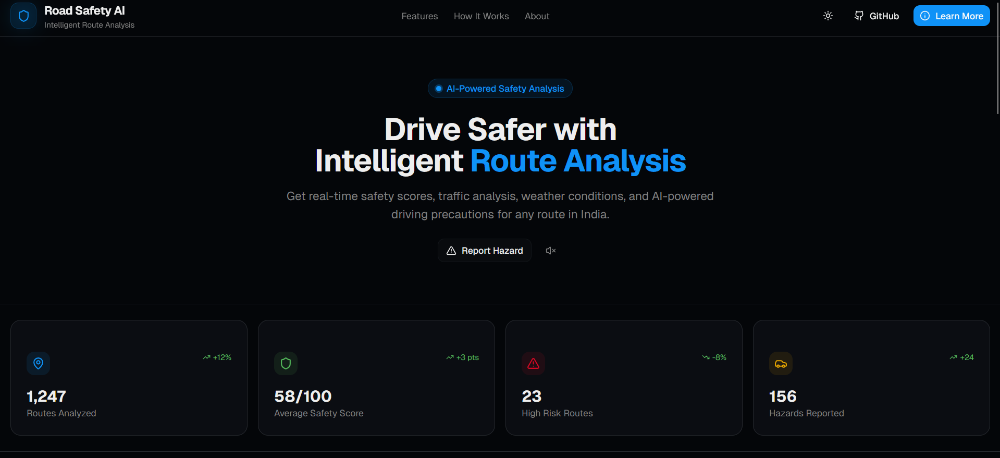
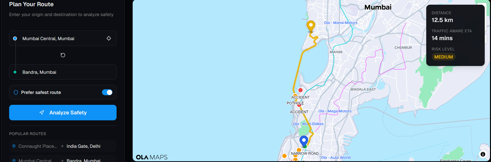
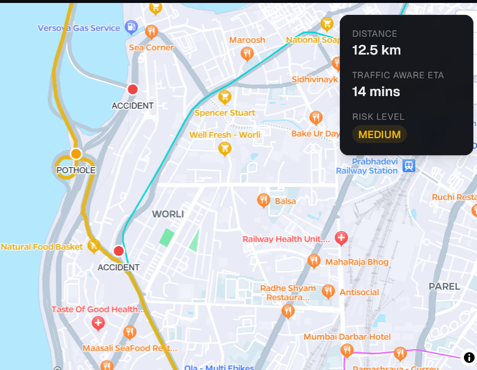
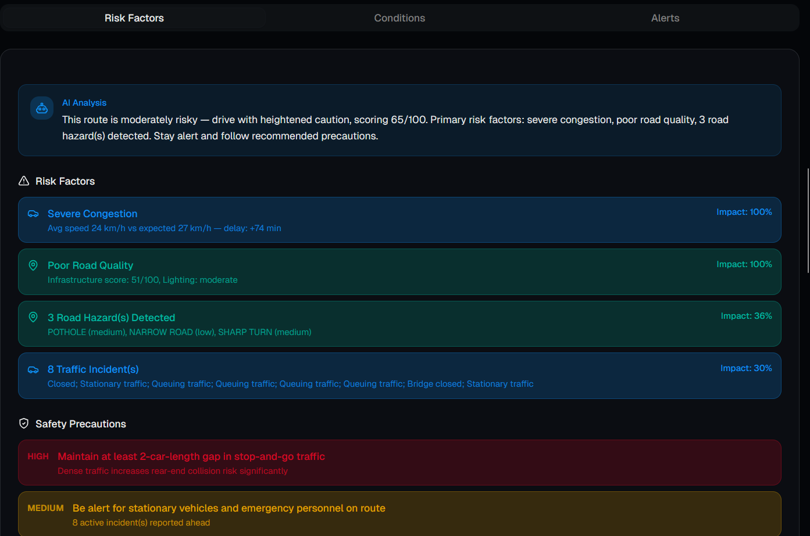
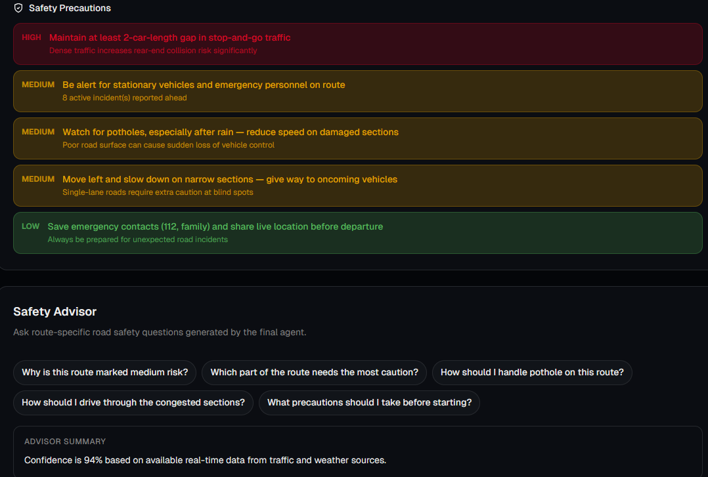

# 🛡️ Road Safety AI

> AI-powered route risk analysis using real-time maps, traffic, weather, road condition signals, and agentic AI.

Road Safety AI helps drivers understand route safety before starting a trip. Instead of showing only distance and ETA, the app analyzes traffic congestion, weather, road hazards, road quality, time-of-day risk, and AI-generated precautions.

---

## 📌 Table of Contents

- [🚨 Business Problem](#-business-problem)
- [💡 Possible Solution](#-possible-solution)
- [✅ Implemented Solution](#-implemented-solution)
- [🧠 Agentic Architecture](#-agentic-architecture)
- [🧰 Tech Stack](#-tech-stack)
- [📡 APIs, Tools, and Data Sources](#-apis-tools-and-data-sources)
- [⚙️ How to Run Locally](#️-how-to-run-locally)
- [🧪 API Response Format](#-api-response-format)
- [🖼️ Screenshots](#️-screenshots)
- [🎥 Recording](#-recording)
- [🧩 Problems Faced and Solutions](#-problems-faced-and-solutions)
- [📚 References and Resources](#-references-and-resources)

---

## 🚨 Business Problem

Most navigation apps optimize for **shortest route** or **fastest ETA**, but road safety depends on many changing factors:

| Challenge | Impact |
|---|---|
| 🚦 Real-time traffic congestion | Increases delay, stress, lane changes, and accident probability |
| 🌧️ Weather conditions | Rain, fog, storms, and low visibility reduce driving safety |
| 🕳️ Road hazards | Potholes, narrow roads, bad roads, and sharp turns increase risk |
| 🌙 Time of day | Night driving and rush hours create different safety profiles |
| ❓ Lack of explanation | Users need actionable precautions, not only a map path |

The business need is a **safety-aware route intelligence system** that helps drivers make better decisions before and during a trip.

---

## 💡 Possible Solution

A strong solution should:

- 🗺️ Fetch route and location data from a reliable map provider.
- 🚦 Use real-time traffic APIs to detect congestion and incidents.
- 🌦️ Include weather signals such as visibility, precipitation, and wind speed.
- 🛣️ Detect road condition risk from route geometry and road metadata.
- 🧠 Use agents to separate responsibilities and reduce messy backend logic.
- 📊 Calculate a deterministic safety score so the system remains explainable.
- 💬 Use an LLM only for explanation and advice, not for inventing risk scores.
- 🧯 Include fallbacks and confidence scores when real-time data is missing.

---

## ✅ Implemented Solution

Road Safety AI is implemented as a full-stack Next.js application with a LangGraph-based agent pipeline.

### Core Capabilities

- 🔍 Ola Maps search suggestions for origin and destination.
- 🧭 Road-following route rendering using Ola Maps and OSRM fallback.
- 🚦 TomTom real-time traffic flow sampling and incident lookup.
- 📊 Congestion score from `0-100`.
- 🌦️ Weather-aware safety analysis using OpenWeather.
- 🛣️ Road condition and hazard detection along the route.
- 🧠 3-agent LangGraph backend pipeline.
- 💬 Gemini-powered Safety Advisor with deterministic fallback.
- 🧯 Guardrails to avoid hallucinated claims when data is unavailable.
- 📍 Hazard and traffic incident markers displayed on the map.
- 📱 Responsive UI for desktop and mobile.

---

## 🧠 Agentic Architecture

The app uses **LangGraph** to orchestrate three agents:

| Agent | Responsibility |
|---|---|
| 🧭 Route Context Agent | Collects route, traffic, road condition, weather, and time factors using structured tools |
| 📊 Risk Detection Agent | Runs deterministic risk scoring and identifies contributing safety factors |
| 💬 Safety Advisor Agent | Uses Gemini to generate explanations, precautions, and suggested user questions |

### Architecture Diagram



### Agent Tool System

Agents use structured tools only:

```ts
getRouteData(origin, destination)
getTrafficData(route)
getWeatherData(location)
getRoadCondition(route)
```

### Risk Formula

```ts
risk_score =
  traffic * 0.35 +
  road_quality * 0.25 +
  weather * 0.20 +
  time_of_day * 0.20
```

Risk levels:

| Score Range | Risk Level |
|---|---|
| `0-33` | LOW |
| `34-66` | MEDIUM |
| `67-100` | HIGH |

---

## 🧰 Tech Stack

| Layer | Technologies |
|---|---|
| Frontend | Next.js 16, React 19, TypeScript |
| Styling | Tailwind CSS, shadcn/Radix UI |
| Maps | Ola Maps Web SDK |
| Backend | Next.js API Routes |
| Agent Framework | LangGraph |
| LLM | Google Gemini API |
| Traffic | TomTom Traffic API |
| Weather | OpenWeather API |
| Route Fallback | OSRM |
| Database | MongoDB |
| HTTP Client | Axios, Fetch |
| Build Tools | Turbopack, TypeScript |

---

## 📡 APIs, Tools, and Data Sources

| API / Tool | Usage |
|---|---|
| Ola Maps Places Autocomplete | Search suggestions for origin and destination |
| Ola Maps Geocoding | Convert place names into coordinates |
| Ola Maps Reverse Geocoding | Convert current location coordinates into readable address |
| Ola Maps Directions | Primary route provider where available |
| OSRM | Road-following fallback when Ola route is unavailable |
| TomTom Traffic Flow Segment Data | Real-time speed and free-flow speed sampling along route |
| TomTom Incident Details | Real-time traffic incidents within route bounding box |
| OpenWeather | Weather condition, temperature, humidity, visibility, wind, precipitation |
| Google Gemini | Natural language explanation, driving tips, suggested safety questions |
| MongoDB | Risk logs and route history |

---

## ⚙️ How to Run Locally

### 1. Clone the Repository

```bash
git clone <your-repository-url>
cd "RoadSafety AI"
```

### 2. Install Dependencies

```bash
npm install
```

### 3. Create Environment File

Create `.env.local` in the project root:

```env
OLA_MAPS_API_KEY=your_ola_maps_api_key
TOMTOM_API_KEY=your_tomtom_api_key
OPENWEATHER_API_KEY=your_openweather_api_key
GEMINI_API_KEY=your_gemini_api_key
GEMINI_MODEL=gemini-2.5-flash
MONGODB_URI=your_mongodb_connection_string
NEXT_PUBLIC_APP_URL=http://localhost:3000
```

`MONGODB_URI` is optional for core route analysis. If it is missing or unavailable, the app can still return analysis results.

### 4. Start Development Server

```bash
npm run dev
```

Open:

```text
http://localhost:3000
```

### 5. Production Build

```bash
npm run build
npm run start
```

---

## 🧪 API Response Format

The main endpoint is:

```http
POST /api/analyze
```

Example request:

```json
{
  "origin": "Pragathi Nagar, Hyderabad, Telangana",
  "destination": "Gandi Maisamma, Hyderabad, Telangana",
  "preferSafest": true,
  "originCoords": { "lat": 17.5217, "lng": 78.3916 },
  "destCoords": { "lat": 17.573786, "lng": 78.42156 }
}
```

Example response:

```json
{
  "success": true,
  "data": {
    "traffic": {
      "congestionLevel": "HIGH",
      "congestionScore": 44,
      "source": "TOMTOM_REALTIME"
    },
    "riskAnalysis": {
      "risk_score": 61,
      "risk_level": "MEDIUM",
      "confidence": 90,
      "factors": [],
      "precautions": []
    },
    "suggestedQueries": [
      "Why is this route marked medium risk?",
      "Which part of the route needs the most caution?"
    ]
  }
}
```

---

## 🖼️ Screenshots

The implementation screenshots are stored in:

```text
public/screenshots/
```

| Screen | Preview | Explanation |
|---|---|---|
| Home / Dashboard |  | Landing page and main Road Safety AI dashboard entry point |
| Route Analysis |  | Route planning flow with origin/destination analysis and map output |
| Hazard Markers |  | Map layer showing detected road hazards and traffic incident points |
| Risk Panel |  | Risk factors, alerts, traffic context, and safety recommendations |
| Safety Advisor |  | AI-assisted safety questions and route-specific driving guidance |

---

## 🎥 Recording

Add a demo recording link here:

```md
🎬 Demo Video: <your-demo-video-link>
```

Suggested recording flow:

1. Open the app.
2. Enter origin and destination.
3. Show Ola Maps route rendering.
4. Highlight TomTom congestion score.
5. Show weather and road condition panels.
6. Show hazard markers on the map.
7. Show Safety Advisor suggested questions.

---

## 🧩 Problems Faced and Solutions

| Problem | Solution |
|---|---|
| Route was drawn as a straight line instead of following roads | Added OSRM road geometry fallback when Ola Directions returns no route |
| Ola Maps route lookup sometimes returned `Route Not Found` | Kept Ola as primary but added provider fallback order |
| Need real-time traffic instead of heuristic-only traffic | Integrated TomTom Flow Segment Data and Incident Details APIs |
| Traffic score did not reflect incidents when flow speed looked normal | Added incident severity penalty into congestion score |
| Gemini API hit quota limit | Added deterministic Safety Advisor fallback so the app still returns safe explanations |
| Needed modular agent architecture | Added LangGraph three-agent workflow |
| Avoid hallucinated safety claims | Kept deterministic scoring and fallback warnings; Gemini only explains available data |
| UI needed hazard locations | Added map layers for road hazards and traffic incident markers |
| Responsiveness issues on smaller screens | Adjusted layout, map sizing, tabs, and cards for mobile-friendly rendering |

---

## 📚 References and Resources

- 🗺️ [Ola Maps](https://maps.olakrutrim.com/)
- 🚦 [TomTom Traffic API - Flow Segment Data](https://developer.tomtom.com/traffic-api/documentation/tomtom-maps/traffic-flow/flow-segment-data)
- 🚧 [TomTom Traffic API - Incident Details](https://developer.tomtom.com/traffic-api/documentation/traffic-incidents/incident-details)
- 🌦️ [OpenWeather API](https://openweathermap.org/api)
- 🧭 [OSRM Project](https://project-osrm.org/)
- 🧠 [LangGraph Documentation](https://docs.langchain.com/oss/javascript/langgraph/overview)
- 🤖 [Google Gemini API Documentation](https://ai.google.dev/gemini-api/docs)
- ⚛️ [Next.js Documentation](https://nextjs.org/docs)
- 🎨 [Tailwind CSS](https://tailwindcss.com/)
- 🧩 [shadcn/ui](https://ui.shadcn.com/)

---

## ✅ Current Status

- ✅ Ola Maps UI integrated
- ✅ Search suggestions implemented
- ✅ Road-following route rendering fixed
- ✅ TomTom real-time traffic integrated
- ✅ Congestion score added
- ✅ Weather analysis implemented
- ✅ Road hazard detection implemented
- ✅ LangGraph three-agent architecture implemented
- ✅ Gemini Safety Advisor integrated with fallback
- ✅ Responsive UI improvements added

---

## 🚀 Future Scope

- 🧑‍🤝‍🧑 Crowdsourced user hazard reports with verification.
- 🏍️ Separate risk profiles for bikes, cars, trucks, and night driving.
- 🛣️ Safer alternative route comparison.
- 🔊 Voice-based driving precautions.
- 📱 Mobile app version.
- 🧯 Emergency assistance integration.
- 📈 Historical accident dataset integration for predictive risk modeling.
- 🛰️ More advanced satellite or municipal road-quality data integration.
